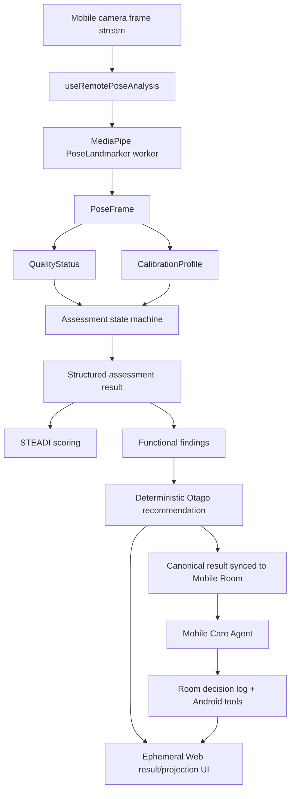

# Steply Structured Pipeline Architecture

This document describes the current implementation architecture for the structured analysis pipeline. It is an engineering description, not a clinical validation claim.

## Runtime Overview



## Key Files

- Pose input and frame control: `client/src/pipeline/pose/frameProcessor.js`
- MediaPipe worker integration: `client/src/pose/poseLandmarker.worker.js`
- PoseFrame adapter: `client/src/pipeline/pose/poseFrameAdapter.js`
- Coordinate utilities: `client/src/pipeline/pose/coordinateMapping.js`
- Quality scoring: `client/src/pipeline/quality/frameQualityMetrics.js`
- Quality state machine: `client/src/pipeline/quality/qualityStateMachine.js`
- Calibration profile: `client/src/pipeline/calibration/calibrationProfile.js`
- Personal calibration: `client/src/pipeline/calibration/personalCalibration.js`
- Chair Stand state machine: `client/src/pipeline/assessment/chairStand/chairStandStateMachine.js`
- Balance Test state machine: `client/src/pipeline/assessment/balanceTest/balanceTestStateMachine.js`
- Functional findings: `client/src/pipeline/findings/functionalFindings.js`
- Otago recommendation engine: `client/src/pipeline/recommendation/otagoExerciseEngine.js`
- Mobile Care Agent: `Steply-mobile/app/src/main/java/com/steply/app/care`
- Web projection contract: `shared/stage4CareAgentContract.cjs`
- UI flow adapter: `client/src/pipeline/ui/sessionFlow.js`

## Web Presentation Layer

The reference desktop UI is organized by product feature under
`client/src/features/reference-ui`:

- Shared application shell and navigation: `shared/ReferenceShell.jsx`
- Shared live camera adapter: `shared/LiveCamera.jsx`
- Shared presentation primitives: `shared/components.jsx`
- Home, assessment landing, and settings: `overview/`
- Weekly report: `reports/`
- Exercise plan and guided exercise: `exercises/`
- Posture results and balance assessment: `assessment/`
- Phone connection: `connection/`

Each feature keeps screen data in a colocated `*Data.js` module. The public
screen exports are collected by `client/src/features/reference-ui/index.js`,
and `client/src/routes/RouteScaffold.jsx` is responsible only for routing to
those screens. Styles follow the same feature boundaries under
`client/src/styles/reference-ui/`, with `reference-ui.css` acting as the import
entry point.

## Configuration

All threshold versions are centralized under `client/src/pipeline/shared/config`:

- `pose.config.js`
- `quality.config.js`
- `calibration.config.js`
- `chairStand.config.js`
- `balance.config.js`
- `functionalFindings.config.js`
- `stage2Analysis.config.js`

## Validation Tools

- Landmark replay runner: `scripts/validation/landmarkReplayRunner.mjs`
- CLI wrapper: `scripts/run-landmark-replay.mjs`
- CI check wrapper: `scripts/check-internal-validation.mjs`
- Summary output: `artifacts/validation/internal-validation-summary.json`
- Requirement coverage: `docs/STAGE2_POSE_PIPELINE_TRACEABILITY.md`

Commands:

```bash
npm run validation:check
npm run validation:replay
node scripts/run-landmark-replay.mjs --input path/to/anonymized-landmarks.json --assert
```

## Replacement Status

The structured pipeline is the only in-repo runtime path for Chair Stand and 4-Stage Balance analysis. Legacy mutable analyzers and legacy structured adapters have been removed. Internal engineering validation still uses synthetic fixtures, and the repository does not contain a real or explicitly authorized anonymized human landmark dataset, so this is not a clinical validation claim.
