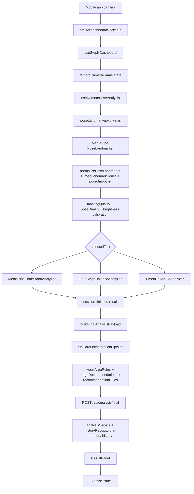

# Steply Current Pipeline Audit

작성일: 2026-07-11

이 문서는 현재 Steply 웹 대시보드의 자세 분석 및 운동 추천 파이프라인을 조사한 결과이다. 이번 단계에서는 임계값, UI, 기존 소스 코드를 수정하지 않았고, 문서만 추가했다.

## 확인 범위

- 실행 확인:
  - `npm run check`
  - `npm run steadi:risk:check`
  - `npm run pose:quality:check`
  - `npm run weak:check`
  - `npm run otago:check`
  - `npm run history:check`
  - `npm run build`
  - `STEPLY_INSECURE_HTTP=1 PORT=3100 CLIENT_PORT=5175 npm run dev`
- 브라우저 확인:
  - `http://localhost:5175/?demoUi=1&screen=setup&debugPose=1`
  - `http://localhost:5175/?demoUi=1&screen=mission&debugPose=1`
  - `http://localhost:5175/?demoUi=1&screen=result&test=chair_stand`
- 모듈 직접 호출 확인:
  - `evaluateSetupReadiness`
  - `MediaPipeChairStandAnalyzer`
  - `FourStageBalanceAnalyzer`
  - `PoseLandmarkSeries`

제한 사항:

- 실제 휴대폰 앱 연결까지는 자동 재현하지 못했다. QR 게이트는 compact 상태에서 payload 텍스트를 화면에 노출하지 않고, 웹 대시보드는 URL의 `sessionId`만으로 기존 세션에 붙는 경로가 없다. 따라서 라이브 모바일 WebSocket 스트림 시나리오는 코드 근거와 브라우저 데모 경로로 확인했고, 판정 로직은 모듈 직접 호출로 재현했다.
- 카메라 이미지 업로드용 상태와 핸들러는 존재하지만, 현재 화면에서 연결된 파일 입력 UI를 찾지 못했다. 정적 이미지 기반 수동 QA는 현재 UI만으로는 수행하기 어렵다.

## 현재 파이프라인 다이어그램



핵심 구조상 프레임 수집, MediaPipe, 품질 검사, 테스트 판정, STEADI 점수, 취약 영역, 추천, 저장, 결과 화면 전환이 모두 React hook, Web Worker, UI 컴포넌트, 에이전트 함수에 넓게 분산되어 있다.

## 실제 사용 중인 파일과 함수 목록

### 1. 카메라 프레임 수집

- 관련 파일:
  - `src/ws/dashboardSocket.js`
  - `client/src/hooks/useSteplyDashboard.js`
  - `src/services/sessionService.js`
  - `src/services/sessionStore.js`
- 핵심 클래스와 함수:
  - `attachDashboardWebSocket` (`src/ws/dashboardSocket.js:48`)
  - `canMobileStream` (`src/ws/dashboardSocket.js:18`)
  - `wireSocket` (`client/src/hooks/useSteplyDashboard.js:221`)
  - `handleRemoteFrameProcessed` (`client/src/hooks/useSteplyDashboard.js:187`)
  - session 생성/프로필 연결/정리 로직 (`src/services/sessionService.js`)
- 입력:
  - 모바일 WebSocket binary JPEG
  - 구버전 JSON base64 frame
  - frame metadata JSON
- 출력:
  - 대시보드 WebSocket으로 metadata JSON 후 binary JPEG 전송 (`src/ws/dashboardSocket.js:108-119`)
  - React 상태 `remoteCameraFrame` (`client/src/hooks/useSteplyDashboard.js:248-257`)
  - 모바일 ACK (`src/ws/dashboardSocket.js:144-154`)
- 상태 저장 위치:
  - 서버 socket: `socket.pendingMobileFrameMeta`, `socket.frameSequence` (`src/ws/dashboardSocket.js:93-103`)
  - 클라이언트 hook: `pendingFrameMetaRef`, `frameObjectUrlRef`, `remoteCameraFrame` (`client/src/hooks/useSteplyDashboard.js:132-134`, `237-257`)
  - 세션 저장소: in-memory Map (`src/services/sessionStore.js`)
- 하드코딩된 임계값:
  - `MAX_DASHBOARD_BUFFERED_BYTES = 250_000` (`src/ws/dashboardSocket.js:8`)
- mock 또는 임시 데이터:
  - 프레임 수집 자체에는 mock이 없지만, QR 없이 볼 수 있는 데모 UI 경로가 별도로 존재한다.
- UI와 분석 로직 결합:
  - 새 프레임이 도착하면 `setActiveStep`로 바로 analysis 화면으로 이동한다 (`client/src/hooks/useSteplyDashboard.js:258-260`, `307-308`).
- 임의 결과 반환:
  - 수집 단계는 임의 결과를 만들지 않는다. 다만 후단 `handleSaveFinal`은 실시간 결과가 없으면 demo payload를 만든다 (`client/src/hooks/useSteplyDashboard.js:404-430`).
- 비동기/race 가능성:
  - binary 메시지는 단일 `pendingFrameMetaRef`와 다음 binary를 짝지어 처리한다 (`client/src/hooks/useSteplyDashboard.js:237-240`, `292-294`). metadata와 binary 순서가 깨지거나 interleave되면 잘못된 meta가 붙을 수 있다.
  - 서버도 binary 수신 시 `socket.pendingMobileFrameMeta` 하나만 사용한다 (`src/ws/dashboardSocket.js:92-95`).
- 동일 프레임 중복 분석:
  - 수집 단계는 `sequence`를 증가시키지만, 클라이언트에서 sequence가 없으면 `Date.now()`를 대체값으로 넣는다 (`client/src/hooks/useSteplyDashboard.js:253`).
- 화면 이동 후 상태 잔존:
  - `session-cleared` 때는 정리한다 (`client/src/hooks/useSteplyDashboard.js:278-290`). 일반 화면 이동에서는 `remoteCameraFrame`과 pose worker 상태를 자동 reset하지 않는다.
- 테스트 코드:
  - WebSocket transport 전용 테스트는 확인하지 못했다.

### 2. MediaPipe 초기화 및 landmark 추출

- 관련 파일:
  - `client/src/hooks/useRemotePoseAnalysis.js`
  - `client/src/pose/poseLandmarker.worker.js`
  - `client/src/pose/poseTimeSeries.js`
  - `client/src/pose/poseSmoother.js`
- 핵심 클래스와 함수:
  - `createPoseWorker` (`client/src/hooks/useRemotePoseAnalysis.js:59`)
  - worker `initLandmarker` (`client/src/pose/poseLandmarker.worker.js:188`)
  - worker `detectPoseFromFrame` (`client/src/pose/poseLandmarker.worker.js:777`)
  - worker `handlePreviewFrame` (`client/src/pose/poseLandmarker.worker.js:823`)
  - worker `handleFrame` (`client/src/pose/poseLandmarker.worker.js:920`)
  - `normalizePoseLandmarks`, `PoseLandmarkSeries`, `createPoseSmootherForTest`
- 입력:
  - Blob, ImageBitmap 가능 frame payload
  - selected test
  - optional config
- 출력:
  - `pose-frame`
  - `preview-frame`
  - `analysis-frame`
  - `session-finished`
- 상태 저장 위치:
  - worker 전역 변수: `landmarker`, `selectedTest`, `analyzer`, `session`, `frameSequence`, `isAnalyzingFrame`, `pendingPreviewFrame`, `pendingAnalysisFrame` (`client/src/pose/poseLandmarker.worker.js:38-67`)
  - hook state: landmarks, rawLandmarks, analysisState, analysisResult, workerStatus (`client/src/hooks/useRemotePoseAnalysis.js:121-279`)
- 하드코딩된 임계값:
  - model paths: lite/full/heavy (`client/src/pose/poseLandmarker.worker.js:13-18`)
  - `MIN_FRAME_INTERVAL_MS = 66`, `MAX_INPUT_FRAME_AGE_MS = 500` (`client/src/pose/poseLandmarker.worker.js:20-21`)
  - `MIN_POSE_CONFIDENCE = 0.65` (`client/src/pose/poseLandmarker.worker.js:32`)
  - `numPoses: 1`, detection/presence/tracking confidence 0.65 (`client/src/pose/poseLandmarker.worker.js:213-223`)
- mock 또는 임시 데이터:
  - MediaPipe 자체는 실제 모델을 사용한다. 단, hook에는 finish fallback 결과 생성이 있다 (`client/src/hooks/useRemotePoseAnalysis.js:320-339`).
- UI와 분석 로직 결합:
  - hook이 worker message를 React 화면 상태로 직접 변환하고, 최종 결과 콜백까지 실행한다 (`client/src/hooks/useRemotePoseAnalysis.js:220-230`).
- 임의 결과 반환:
  - worker가 `session-finished`를 1.2초 안에 보내지 않으면 `fallbackResultFromState`가 최종 결과를 만든다 (`client/src/hooks/useRemotePoseAnalysis.js:320-339`).
- 비동기/race 가능성:
  - worker queue는 preview와 analysis 각각 최신 1개만 유지한다 (`client/src/pose/poseLandmarker.worker.js:1173-1215`, `1259-1277`).
  - `isAnalyzingFrame`이 true면 pump를 재예약한다 (`client/src/pose/poseLandmarker.worker.js:1217-1222`).
  - active session 중에는 analysis frame을 우선 처리하고 preview frame을 버린다 (`client/src/pose/poseLandmarker.worker.js:1205-1210`).
- 동일 프레임 중복 분석:
  - hook은 `remoteCameraFrame.sequence || receivedAt || src`로 중복 제출을 막는다 (`client/src/hooks/useRemotePoseAnalysis.js:403-405`). sequence가 없고 object URL만 바뀌면 같은 이미지도 새 frame으로 처리될 수 있다.
- 화면 이동 후 상태 잔존:
  - `selectedTest` 변경 때만 hook이 reset-session을 보낸다 (`client/src/hooks/useRemotePoseAnalysis.js:368-394`). activeStep 변경만으로는 reset되지 않는다.
- 테스트 코드:
  - MediaPipe 실제 모델 inference를 검증하는 자동 테스트는 확인하지 못했다.

### 3. 캘리브레이션

- 관련 파일:
  - `client/src/pose/poseLandmarker.worker.js`
  - `client/src/pose/poseQuality.js`
  - `client/src/components/AnalysisPanel.jsx`
- 핵심 함수:
  - `buildBrightnessCalibration`
  - `recordBrightnessCalibrationSample`
  - `brightnessQualityContext`
  - `evaluateSetupReadiness`
  - AnalysisPanel readiness countdown
- 입력:
  - preview/analysis frame brightness sample
  - landmarks and prior sample
- 출력:
  - brightness calibration object
  - setup readiness state
- 상태 저장 위치:
  - worker 전역 `brightnessCalibrationSamples`, `brightnessCalibration`, `latestBrightnessSample` (`client/src/pose/poseLandmarker.worker.js:55-58`)
  - React state `brightnessCalibration` (`client/src/hooks/useRemotePoseAnalysis.js:202`, `216`)
- 하드코딩된 임계값:
  - brightness target/min sample/limit/correction/hard bounds (`client/src/pose/poseLandmarker.worker.js:22-28`)
  - `READY_HOLD_SECONDS = 3` (`client/src/pose/poseQuality.js:8`)
- mock 또는 임시 데이터:
  - 실제 biomechanical calibration은 없다. 현재 캘리브레이션은 brightness 보정과 setup readiness hold에 가깝다.
- UI와 분석 로직 결합:
  - AnalysisPanel이 readiness countdown과 start 조건을 직접 관리한다 (`client/src/components/AnalysisPanel.jsx:459-501`).
- 임의 결과 반환:
  - 캘리브레이션 단계에서는 없음.
- 비동기/race 가능성:
  - preview frame에서 calibration sample을 갱신하고 analysis frame에서 같은 전역 calibration을 참조한다.
- 동일 프레임 중복 분석:
  - frame queue 정책에 종속된다.
- 화면 이동 후 상태 잔존:
  - `resetSession` 때 brightness calibration이 reset된다 (`client/src/pose/poseLandmarker.worker.js:1332-1350`). activeStep 변경만으로는 reset되지 않는다.
- 테스트 코드:
  - 별도 brightness calibration 테스트는 확인하지 못했다.

### 4. 품질 검사

- 관련 파일:
  - `client/src/pose/trackingQuality.js`
  - `client/src/pose/poseQuality.js`
  - `client/src/pose/poseLandmarker.worker.js`
  - `client/src/components/AnalysisPanel.jsx`
- 핵심 함수:
  - `evaluateCameraReadiness` (`client/src/pose/trackingQuality.js:297`)
  - `evaluateSetupReadiness` (`client/src/pose/poseQuality.js:173`)
  - `shouldBlockFrame` (`client/src/pose/poseLandmarker.worker.js:564`)
  - `shouldBlockMovementFrame` (`client/src/pose/poseLandmarker.worker.js:574`)
  - `shouldInvalidateSession` (`client/src/pose/poseLandmarker.worker.js:582`)
- 입력:
  - normalized landmarks
  - poseCount
  - brightness
  - previous quality sample
  - selected test
- 출력:
  - readiness object
  - trackingQuality object
  - blocked frame state
  - invalid final result
- 상태 저장 위치:
  - worker `latestQualitySample`, `sessionQuality`, `latestAnalysisQualityPayload` (`client/src/pose/poseLandmarker.worker.js:53-62`)
  - UI debug state in hook and AnalysisPanel
- 하드코딩된 임계값:
  - `TRACKING_QUALITY_ALLOW = 0.8`, `TRACKING_QUALITY_MIN_RESULT = 0.6` (`client/src/pose/trackingQuality.js:14-15`)
  - `MIN_VISIBILITY = 0.55`, body height 0.38 to 0.9, center/size jump thresholds (`client/src/pose/trackingQuality.js:67-72`)
  - required landmarks (`client/src/pose/trackingQuality.js:17-31`)
  - session invalidation: accepted frames `< 3`, quality `< 0.6`, low quality ratio `>= 0.35` (`client/src/pose/poseLandmarker.worker.js:35-36`, `582-587`)
- mock 또는 임시 데이터:
  - `npm run pose:quality:check`는 synthetic landmarks를 사용한다.
- UI와 분석 로직 결합:
  - 품질 결과가 AnalysisPanel debug UI와 auto-start UX에 직접 연결된다.
- 임의 결과 반환:
  - 품질 낮으면 `invalidTrackingResult`가 최종 result 형태를 만든다 (`client/src/pose/poseLandmarker.worker.js:590-617`). 이것은 임의 성공 결과는 아니고 invalid 결과다.
- 비동기/race 가능성:
  - preview quality interval 250ms, analysis quality interval 200ms로 cache를 사용한다 (`client/src/pose/poseLandmarker.worker.js:29-30`).
  - `shouldBlockFrame`은 brightness와 score를 보지만 `shouldBlockMovementFrame`은 full body, feet, single person만 본다 (`client/src/pose/poseLandmarker.worker.js:564-580`). 낮은 brightness/quality frame이 movement analyzer로 들어갈 수 있고, 최종 invalidation이 나중에 막는 구조다.
- 동일 프레임 중복 분석:
  - 품질 계산 cache가 frame 단위가 아니라 interval 단위이므로 서로 다른 frame에 같은 cached payload가 붙을 수 있다.
- 화면 이동 후 상태 잔존:
  - reset-session 시 quality 상태는 초기화된다 (`client/src/pose/poseLandmarker.worker.js:1294-1299`, `1342-1347`). 화면 이동만으로는 초기화되지 않는다.
- 테스트 코드:
  - `scripts/check-pose-quality.mjs`

### 5. 30-second Chair Stand 판정

- 관련 파일:
  - `client/src/pose/chairStandAnalyzer.js`
  - `client/src/pose/movementAnalyzers.js`
  - `client/src/pose/steadiRules.js`
- 핵심 클래스와 함수:
  - `MediaPipeChairStandAnalyzer` (`client/src/pose/chairStandAnalyzer.js:144`)
  - `addFrame` (`client/src/pose/chairStandAnalyzer.js:157`)
  - `updateRepetitionCount`
  - `updateArmRule` (`client/src/pose/chairStandAnalyzer.js:385`)
  - `finalHalfStandCredit` (`client/src/pose/chairStandAnalyzer.js:396`)
  - `finishSession` (`client/src/pose/chairStandAnalyzer.js:219`)
- 입력:
  - timestamped normalized landmarks
  - confidence
  - session startedAt
- 출력:
  - current state with repetition count, phase, warnings
  - final result with reps, quality metrics, flags
- 상태 저장 위치:
  - analyzer instance fields: repetitionCount, phase/cycle flags, samples, repEvents, arm support counters
  - worker global `analyzer` (`client/src/pose/poseLandmarker.worker.js:40`)
- 하드코딩된 임계값:
  - min landmark visibility 0.45
  - required seated/standing frames 1
  - arm support disqualify frames 3
  - standing knee angle 150
  - seated knee angle 128
  - halfway knee angle 138
  - trunk/stability warning scores 0.55/0.45
  - exact constants: `client/src/pose/chairStandAnalyzer.js:17-38`
- mock 또는 임시 데이터:
  - no mock inside analyzer.
  - demo final result hardcodes chair stand 9 reps (`client/src/data/serviceModels.js:77-95`).
- UI와 분석 로직 결합:
  - analyzer는 UI에서 분리된 class지만 worker lifecycle에 강하게 묶여 있다.
  - manual repetition message가 worker를 통해 analyzer를 직접 조작한다 (`client/src/pose/poseLandmarker.worker.js:1364-1367`).
- 임의 결과 반환:
  - analyzer 자체는 임의 성공 결과를 만들지 않는다. hook fallback은 analyzer state 기반 final을 만들 수 있다.
- 비동기/race 가능성:
  - frame queue가 최신 frame만 유지하므로 빠른 sit/stand cycle 일부가 누락될 수 있다.
- 동일 프레임 중복 분석:
  - timestamp 중복 방어는 analyzer 책임으로 명확히 분리되어 있지 않다.
- 화면 이동 후 상태 잔존:
  - worker reset 전에는 analyzer instance가 유지된다.
- 테스트 코드:
  - `npm run check` 내부 chair stand count checks
  - `scripts/log-chair-stand-sequence.mjs`

중요 코드 근거:

- STEADI rule summary는 "halfway up at the end"를 1 rep로 credit한다고 적는다 (`client/src/pose/steadiRules.js:5-8`).
- 실제 `finalHalfStandCredit()`는 항상 `0`을 반환한다 (`client/src/pose/chairStandAnalyzer.js:396-398`).

### 6. 4-Stage Balance Test 판정

- 관련 파일:
  - `client/src/pose/fourStageBalanceAnalyzer.js`
  - `client/src/pose/movementAnalyzers.js`
  - `client/src/pose/steadiRules.js`
  - `client/src/components/AnalysisPanel.jsx`
- 핵심 클래스와 함수:
  - `FourStageBalanceAnalyzer` (`client/src/pose/fourStageBalanceAnalyzer.js:963`)
  - `addFrame` (`client/src/pose/fourStageBalanceAnalyzer.js:976`)
  - `updateOfficialProtocol` (`client/src/pose/fourStageBalanceAnalyzer.js:1137`)
  - `finishSession` (`client/src/pose/fourStageBalanceAnalyzer.js:995`)
  - `analyzeFourStageBalanceSeries`
- 입력:
  - timestamped normalized landmarks
  - selected test
- 출력:
  - official protocol state
  - tandem hold seconds as primary value
  - balanceResult with stage metrics
- 상태 저장 위치:
  - analyzer fields: `frames`, `officialProtocol`, active stage state, current stage samples
  - worker global analyzer
- 하드코딩된 임계값:
  - stage target 10 seconds each (`client/src/pose/fourStageBalanceAnalyzer.js:20-25`)
  - `minVisibility 0.45`, dynamic adjustment 3.5s, entry confirm 650ms, exit confirm 700ms, foot movement threshold 0.16, support ratio 0.12 (`client/src/pose/fourStageBalanceAnalyzer.js:27-36`)
- mock 또는 임시 데이터:
  - demo final result hardcodes balance primary value 8.6 seconds (`client/src/data/serviceModels.js:77-95`, `133-138`).
- UI와 분석 로직 결합:
  - UI에도 balance protocol fallback/guidance logic이 있다 (`client/src/components/AnalysisPanel.jsx:170-197`), analyzer와 화면 표현이 완전히 분리되어 있지 않다.
- 임의 결과 반환:
  - analyzer 자체는 임의 성공 결과를 만들지 않는다. App demo mode는 demo result를 쓴다.
- 비동기/race 가능성:
  - lost/missing frames and frame drops can affect stage entry/exit confirmation because timing is frame based.
- 동일 프레임 중복 분석:
  - `normalizeFrame(frame, this.frames.length)`가 frame order에 의존한다 (`client/src/pose/fourStageBalanceAnalyzer.js:976-982`).
- 화면 이동 후 상태 잔존:
  - worker reset 전에는 analyzer state와 frames가 유지된다.
- 테스트 코드:
  - `npm run check` 내부 4-stage balance official protocol checks
  - `scripts/log-balance-sequence.mjs`

### 7. 취약 영역 도출

- 관련 파일:
  - `client/src/pose/weakAreaRules.js`
  - `client/src/pose/assessmentRules.js`
  - `client/src/agents/careOrchestrationAgent.js`
- 핵심 함수:
  - `analyzeWeakAreaResult`
  - `identifyWeakAreas`
  - `buildAssessmentResult`
  - care agent Otago stage calls `analyzeWeakAreaResult`
- 입력:
  - chairStandResult
  - balanceResult
  - profile
  - history
- 출력:
  - weak area ids
  - weak area labels
  - rule evidence
  - scores
- 상태 저장 위치:
  - pure rule functions, 별도 persistent state 없음
- 하드코딩된 임계값:
  - ankle AP stddev/range/velocity/foot exit thresholds (`client/src/pose/weakAreaRules.js:51-59`)
  - hip ML thresholds (`client/src/pose/weakAreaRules.js:68-74`)
  - lower-limb trunk lean thresholds (`client/src/pose/weakAreaRules.js:81-85`)
- mock 또는 임시 데이터:
  - `scripts/check-weak-areas.mjs` uses synthetic cases.
- UI와 분석 로직 결합:
  - rule은 비교적 분리되어 있으나 최종 payload 생성과 care agent에서 호출된다 (`client/src/hooks/useSteplyDashboard.js:58-112`, `client/src/agents/careOrchestrationAgent.js:1-19`).
- 임의 결과 반환:
  - demo final result injects weak area ids/scores (`client/src/data/serviceModels.js:102-119`).
- 비동기/race 가능성:
  - pure calculation이라 자체 race는 낮다.
- 동일 프레임 중복 분석:
  - final result의 balance/chair features에 의존한다.
- 화면 이동 후 상태 잔존:
  - finalResult가 남아 있으면 UI는 같은 취약 영역을 계속 표시한다.
- 테스트 코드:
  - `npm run weak:check`

### 8. Otago 운동 추천

- 관련 파일:
  - `client/src/pose/otagoRecommendations.js`
  - `client/src/pose/recommendationRules.js`
  - `client/src/data/recommendationExercises.js`
  - `client/src/components/ExercisePanel.jsx`
- 핵심 함수:
  - `otagoExerciseKeysForWeakAreas` (`client/src/pose/otagoRecommendations.js:118`)
  - `otagoRecommendationsForWeakAreas` (`client/src/pose/otagoRecommendations.js:133`)
  - `recommendationTemplatesForResult`
  - `buildExerciseSourceList` (`client/src/components/ExercisePanel.jsx:143`)
- 입력:
  - weak area ids or weak area result
  - final result
- 출력:
  - exercise recommendation objects
  - ExercisePanel cards
- 상태 저장 위치:
  - recommendation catalog constants
  - ExercisePanel local active exercise id
- 하드코딩된 임계값:
  - catalog durations 30 to 60 seconds (`client/src/pose/otagoRecommendations.js:14-75`)
  - weak area to exercise mapping (`client/src/pose/otagoRecommendations.js:77-93`)
  - recommendation difficulty/profile thresholds in `recommendationRules.js`
- mock 또는 임시 데이터:
  - fallback static exercise list is always merged when dynamic templates exist (`client/src/components/ExercisePanel.jsx:143-155`).
  - demo final result injects Side Hip Strengthening or Sit-to-Stand Practice.
- UI와 분석 로직 결합:
  - ExercisePanel recomputes recommendation templates from final result and merges UI fallback exercises (`client/src/components/ExercisePanel.jsx:219-231`).
- 임의 결과 반환:
  - no arbitrary result, but fallback exercises can appear even without Otago-derived weak area.
- 비동기/race 가능성:
  - local UI only.
- 동일 프레임 중복 분석:
  - not applicable.
- 화면 이동 후 상태 잔존:
  - finalResult drives exercise list; if previous finalResult remains, exercise screen uses prior recommendation.
- 테스트 코드:
  - `npm run otago:check`

### 9. 사용자 기록 저장

- 관련 파일:
  - `src/services/analysisService.js`
  - `src/repositories/historyRepository.js`
  - `src/controllers/analysisController.js`
  - `client/src/hooks/useSteplyDashboard.js`
  - `client/src/data/demoHistory.js`
- 핵심 함수:
  - `saveRealtimeResult` (`src/services/analysisService.js:6`)
  - `saveFinalResult` (`src/services/analysisService.js:25`)
  - `addHistoryItem` (`src/repositories/historyRepository.js:19`)
  - `refreshHistory` (`client/src/hooks/useSteplyDashboard.js:138`)
  - `handlePoseFinalResult` (`client/src/hooks/useSteplyDashboard.js:166`)
  - `handleSaveFinal` (`client/src/hooks/useSteplyDashboard.js:404`)
- 입력:
  - final analysis payload
  - session id
  - selected test
- 출력:
  - session finalResult
  - in-memory history item
  - dashboard WebSocket final message
- 상태 저장 위치:
  - server session object
  - `transientHistoryItems` in process memory (`src/repositories/historyRepository.js:4`)
  - client finalResult/historyItems state
- 하드코딩된 임계값:
  - 없음. 다만 `handleSaveFinal` fallback score 85가 있다 (`client/src/hooks/useSteplyDashboard.js:414`).
- mock 또는 임시 데이터:
  - `buildDemoHistoryItems` (`client/src/data/demoHistory.js:35`)
  - history repository comment says phone app owns persistent store and PC keeps process memory only (`src/repositories/historyRepository.js:6-7`)
  - `ensureDataFiles` deletes `HISTORY_PATH` if present (`src/repositories/historyRepository.js:8-11`)
- UI와 분석 로직 결합:
  - final result save, activeStep transition, history refresh are in dashboard hook (`client/src/hooks/useSteplyDashboard.js:166-185`)
- 임의 결과 반환:
  - `handleSaveFinal` uses `liveResult || buildRealtimePayload(session.id, selectedTest)` and fallback score/message (`client/src/hooks/useSteplyDashboard.js:409-416`).
- 비동기/race 가능성:
  - final result can be set optimistically before POST finishes (`client/src/hooks/useSteplyDashboard.js:421-425`).
- 동일 프레임 중복 분석:
  - not applicable.
- 화면 이동 후 상태 잔존:
  - `finalResult` remains until session-cleared or new result.
- 테스트 코드:
  - `npm run history:check`

### 10. Care Orchestration Agent 또는 해당 로직

- 관련 파일:
  - `client/src/agents/careOrchestrationAgent.js`
  - `client/src/hooks/useSteplyDashboard.js`
  - `client/src/pose/assessmentRules.js`
  - `client/src/pose/steadiRules.js`
  - `client/src/pose/weakAreaRules.js`
  - `client/src/pose/otagoRecommendations.js`
- 핵심 함수:
  - `runCareOrchestrationPipeline` (`client/src/agents/careOrchestrationAgent.js:519`)
  - `buildStep1`
  - motion analysis stage builder
  - pose judgement stage builder
  - Otago prescription stage builder
  - decision/tool trace builders
- 입력:
  - raw final result
  - profile
  - history items
- 출력:
  - staged pipeline object
  - finalResultPatch
  - recommendation plan
  - agent decision
- 상태 저장 위치:
  - stateless deterministic function output embedded into final result (`client/src/hooks/useSteplyDashboard.js:66-78`)
- 하드코딩된 임계값:
  - motion quality gate passes if no camera setup flag and confidence `>= 0.45` (`client/src/agents/careOrchestrationAgent.js:207-263`)
  - stage ids/schema versions (`client/src/agents/careOrchestrationAgent.js:22-34`)
- mock 또는 임시 데이터:
  - no LLM or external agent. It is deterministic orchestration code.
- UI와 분석 로직 결합:
  - agent is run in client hook while building a save payload (`client/src/hooks/useSteplyDashboard.js:58-78`), not in an independent service boundary.
- 임의 결과 반환:
  - agent itself does not synthesize movement counts, but it can produce recommendation plan from fallback/demo result if input is fallback/demo.
- 비동기/race 가능성:
  - pure calculation, low race risk.
- 동일 프레임 중복 분석:
  - not applicable.
- 화면 이동 후 상태 잔존:
  - output remains in finalResult.
- 테스트 코드:
  - `npm run check` includes Care orchestration checks
  - `npm run care:check` exists in `package.json`

### 11. 결과 화면과 운동 화면 연결

- 관련 파일:
  - `client/src/App.jsx`
  - `client/src/components/ResultPanel.jsx`
  - `client/src/components/ExercisePanel.jsx`
  - `client/src/pose/recommendationRules.js`
  - `client/src/data/serviceModels.js`
- 핵심 함수와 props:
  - `shouldShowExercisePanel` (`client/src/App.jsx:102`)
  - `previewStateForTest` (`client/src/App.jsx:117`)
  - `usePreviewPoseAnalysis` (`client/src/App.jsx:136`)
  - `displayFinalResult` (`client/src/App.jsx:285-291`)
  - ResultPanel `onGoExercises` button (`client/src/components/ResultPanel.jsx:404-410`)
  - ExercisePanel recommendation derivation (`client/src/components/ExercisePanel.jsx:215-231`)
- 입력:
  - dashboard activeStep
  - finalResult/liveResult/pose analysis result
  - demo UI URL flags
- 출력:
  - ResultPanel
  - ExercisePanel
  - progress navigation
- 상태 저장 위치:
  - App local state `missionPreviewActive`
  - dashboard hook `activeStep`, `finalResult`, `poseAnalysis.analysisResult`
  - ExercisePanel local `activeExerciseId`
- 하드코딩된 임계값:
  - preview elapsed starts at 12 and loops to 27 (`client/src/App.jsx:136-147`)
  - preview confidence 0.92 (`client/src/App.jsx:165`)
- mock 또는 임시 데이터:
  - `buildDemoFinalResult` provides demo result if `demoMode` and no actual result (`client/src/App.jsx:289-291`)
  - mission preview creates running analysis state without camera (`client/src/App.jsx:117-173`)
- UI와 분석 로직 결합:
  - activeStep, worker status, analysisResult, timeout all decide exercise screen rendering (`client/src/App.jsx:102-110`).
- 임의 결과 반환:
  - `emergencyExerciseResult` can feed ExercisePanel if finalResult is absent (`client/src/App.jsx:453-457`).
- 비동기/race 가능성:
  - worker finish, activeStep, final result save, timedOut condition can race to exercise/result screens.
- 동일 프레임 중복 분석:
  - not applicable.
- 화면 이동 후 상태 잔존:
  - finalResult/analysisResult can keep exercise screen available even if activeStep is not explicitly `exercise`.
- 테스트 코드:
  - no component-level UI test found.

## 재현 결과

### 필수 시나리오 확인표

| 시나리오 | 확인 방법 | 관찰 결과 |
| --- | --- | --- |
| 1. 사람이 화면에 없을 때 | 브라우저 setup 화면 및 `evaluateSetupReadiness([])` | setup 화면: no camera/person 안내. 모듈 결과: `isReady=false`, failing reasons `no_person`, `full_body_not_visible`, `feet_not_visible`, `tracking_quality_below_threshold` 등 |
| 2. 몸 일부만 화면에 들어올 때 | synthetic partial landmarks | `isReady=false`, `full_body_not_visible`, `feet_not_visible`, score 약 0.589 |
| 3. 발이 잘릴 때 | synthetic feet-cut landmarks | `isReady=false`, `feet_not_visible`, score 약 0.743 |
| 4. 사람이 가만히 서 있을 때 | ChairStand analyzer에 standing frames만 입력 | `reps=0`, summary `0 chair stands measured.` |
| 5. 잘못된 균형 자세 | FourStageBalance analyzer에 foot movement scenario 입력 | official protocol `stopped`, `failureReason=feet_moved`, tandem hold 0 |
| 6. 올바른 균형 자세 | FourStageBalance analyzer에 4개 stage hold scenario 입력 | official protocol `completed`, completedCount 4, tandem hold 10 |
| 7. 의자에서 반만 일어났을 때 | ChairStand analyzer에 half stand scenario 입력 | incomplete true, failedAttempts 1, `halfCredit=0` |
| 8. 완전히 일어났을 때 | ChairStand analyzer에 full cycle scenario 입력 | `reps=1`, counted 1 |
| 9. 팔을 사용해 일어났을 때 | ChairStand analyzer에 rising + wrist support frames 입력 | `reps=0`, `armDisqualified=true`, supportFrameCount 3 |
| 10. 카메라가 잠시 landmark를 잃었을 때 | PoseLandmarkSeries에 missing ankle frame 입력 | interpolation count 21, right ankle visibility after smoothing 약 0.684 |
| 11. 검사를 중간에 나갔다가 다시 시작했을 때 | 코드 경로 확인 및 demo UI 화면 전환 확인 | `selectedTest` 변경 때만 worker reset. 일반 activeStep 변경만으로는 worker/analyzer/finalResult를 reset하지 않는다. 라이브 모바일 중단/재시작은 자동 재현하지 못했다. |

### 모듈 직접 호출 관찰값

```json
{
  "noPerson": {
    "isReady": false,
    "score": 0.218,
    "failingReasons": [
      "no_person",
      "single_person_required",
      "full_body_not_visible",
      "feet_not_visible",
      "improper_distance",
      "tracking_quality_below_threshold"
    ]
  },
  "partialBody": {
    "isReady": false,
    "score": 0.589,
    "failingReasons": [
      "full_body_not_visible",
      "feet_not_visible",
      "tracking_quality_below_threshold"
    ]
  },
  "feetCut": {
    "isReady": false,
    "score": 0.743,
    "failingReasons": [
      "full_body_not_visible",
      "feet_not_visible",
      "improper_distance",
      "tracking_quality_below_threshold"
    ]
  },
  "standingStillChair": {
    "reps": 0,
    "summary": "0 chair stands measured."
  },
  "wrongBalance": {
    "protocolStatus": "stopped",
    "failureReason": "feet_moved",
    "completedCount": 1,
    "tandemHold": 0
  },
  "correctBalance": {
    "protocolStatus": "completed",
    "failureReason": null,
    "completedCount": 4,
    "tandemHold": 10
  },
  "supportBalance": {
    "protocolStatus": "stopped",
    "failureReason": "support_used",
    "completedCount": 1,
    "tandemHold": 0
  },
  "halfChairStand": {
    "reps": 0,
    "incomplete": true,
    "failedAttempts": 1,
    "halfCredit": 0
  },
  "fullChairStand": {
    "reps": 1,
    "counted": 1,
    "armDisqualified": false
  },
  "armUseChairStand": {
    "reps": 0,
    "counted": 0,
    "armDisqualified": true,
    "supportFrameCount": 3
  },
  "landmarkLost": {
    "interpolatedCount": 21,
    "rightAnkleVisibilityAfterSmoothing": 0.684
  }
}
```

### 브라우저에서 재현된 UI 문제

1. 카메라가 연결되지 않아도 demo mission 화면은 synthetic 분석 상태를 보여준다.
   - 재현: `http://localhost:5175/?demoUi=1&screen=mission&debugPose=1`
   - 관찰: 화면에 `Record 10`, `Tracking quality: 92%`, `Worker: analyzing`이 표시됨. 실제 phone camera는 연결되지 않았다.
   - 코드 근거: `previewStateForTest`와 `usePreviewPoseAnalysis`가 confidence 0.92와 running state를 만든다 (`client/src/App.jsx:117-173`).

2. 결과 화면은 실제 분석 없이 demo final result를 표시할 수 있다.
   - 재현: `http://localhost:5175/?demoUi=1&screen=result&test=chair_stand`
   - 관찰: `9 Chair Stands`, 추천 운동, 저장 버튼 표시.
   - 코드 근거: `displayFinalResult`가 demo mode에서 `buildDemoFinalResult`를 사용한다 (`client/src/App.jsx:285-291`, `client/src/data/serviceModels.js:54-151`).

3. 결과 화면의 "View Recommended Exercises"는 ExercisePanel로 연결되지만, ExercisePanel은 dynamic recommendation 뒤에 static fallback exercise를 합친다.
   - 재현: 위 result URL에서 버튼 클릭.
   - 관찰: 추천 운동 상세 화면 표시.
   - 코드 근거: ResultPanel button (`client/src/components/ResultPanel.jsx:404-410`), ExercisePanel merge (`client/src/components/ExercisePanel.jsx:143-155`, `219-231`).

## 확인된 오작동과 재현 방법

| ID | 오작동 | 재현 방법 | 코드 근거 |
| --- | --- | --- | --- |
| M01 | 실제 카메라 없이 demo mission이 분석 중인 것처럼 표시된다. | `?demoUi=1&screen=mission&debugPose=1` 접속 | `usePreviewPoseAnalysis`가 `isRunning=true`, `workerStatus='analyzing'`, confidence 0.92를 주입 (`client/src/App.jsx:150-172`) |
| M02 | 실제 분석 없이 demo final result가 결과와 운동 화면을 채운다. | `?demoUi=1&screen=result&test=chair_stand` 접속 | `displayFinalResult` fallback (`client/src/App.jsx:285-291`), hardcoded result (`client/src/data/serviceModels.js:54-151`) |
| M03 | worker finish가 1.2초 안에 오지 않으면 hook이 fallback final result를 만든다. | worker 응답 지연 또는 중단 상태에서 `finishAnalysis` 실행 | `fallbackResultFromState` timer (`client/src/hooks/useRemotePoseAnalysis.js:320-339`) |
| M04 | STEADI summary의 half-stand credit과 실제 구현이 맞지 않는다. | half stand synthetic scenario 실행 | summary says credit (`client/src/pose/steadiRules.js:5-8`), implementation returns 0 (`client/src/pose/chairStandAnalyzer.js:396-398`) |
| M05 | 낮은 brightness/quality를 movement analyzer에서 일관되게 차단하지 않는다. | quality cache 사용 상태에서 분석 frame 처리 경로 확인 | `shouldBlockFrame`은 brightness/score 포함, `shouldBlockMovementFrame`은 제외 (`client/src/pose/poseLandmarker.worker.js:564-580`) |
| M06 | frame queue가 분석/프리뷰 각각 최신 1개만 보존해 중간 frame을 버릴 수 있다. | 빠른 frame 입력 또는 worker busy 상태 | `pendingAnalysisFrame = message`, `pendingPreviewFrame = message`로 overwrite (`client/src/pose/poseLandmarker.worker.js:1259-1277`) |
| M07 | 일반 화면 이동만으로는 이전 분석 session/analyzer state가 reset되지 않는다. | 테스트 중 activeStep을 다른 화면으로 이동 후 복귀 | reset effect dependency가 `selectedTest`뿐 (`client/src/hooks/useRemotePoseAnalysis.js:368-394`) |
| M08 | activeStep이 exercise가 아니어도 worker finished/analysisResult/timedOut이면 exercise 화면이 표시될 수 있다. | final result 또는 worker finished 상태 유지 후 routing 확인 | `shouldShowExercisePanel` 조건 (`client/src/App.jsx:102-110`) |
| M09 | 저장 버튼 경로가 실제 pose final 없이 demo realtime payload를 저장할 수 있다. | session만 만든 뒤 Save Today 결과 호출 | `liveResult || buildRealtimePayload`, fallback score 85 (`client/src/hooks/useSteplyDashboard.js:404-430`, `client/src/data/demoAnalysis.js:7-33`) |
| M10 | PC history는 영속 저장이 아니고 기존 history file을 삭제한다. | `getAllHistory`/history read 경로 확인 | process memory only comment and `unlinkSync(HISTORY_PATH)` (`src/repositories/historyRepository.js:6-16`) |
| M11 | 카메라 정적 이미지 테스트용 상태/핸들러는 있으나 화면에서 연결된 input을 찾지 못했다. | `setupImageFrame`, `handleSetupImageChange` references 검색 | state/ref/handler exists (`client/src/components/AnalysisPanel.jsx:276-285`, `515-529`), input render reference 없음 |

## 코드 근거 요약

- MediaPipe worker는 단일 전역 landmarker와 analyzer를 사용한다: `client/src/pose/poseLandmarker.worker.js:38-67`
- worker init은 model/delegate/threshold를 직접 결정한다: `client/src/pose/poseLandmarker.worker.js:188-223`
- worker queue는 최신 preview/analysis frame만 남긴다: `client/src/pose/poseLandmarker.worker.js:1173-1277`
- hook은 remote frame key로 중복 제출을 막지만 source URL이 바뀌면 같은 frame도 다시 처리될 수 있다: `client/src/hooks/useRemotePoseAnalysis.js:403-405`
- hook은 selectedTest 변경에만 reset-session을 보낸다: `client/src/hooks/useRemotePoseAnalysis.js:368-394`
- demo UI는 실제 분석 없이 결과/미션 상태를 생성한다: `client/src/App.jsx:117-173`, `285-291`
- final save는 client hook에서 agent pipeline까지 실행한다: `client/src/hooks/useSteplyDashboard.js:58-112`
- agent는 LLM이 아니라 deterministic rule pipeline이다: `client/src/agents/careOrchestrationAgent.js:22-34`, `519-636`
- history는 PC process memory only이다: `src/repositories/historyRepository.js:4-16`

## 유지 가능한 코드

- `MediaPipeChairStandAnalyzer`와 `FourStageBalanceAnalyzer`는 class 단위로 분리되어 있어 새 `chairStand`, `balanceTest` 모듈로 옮기기 좋다.
- `trackingQuality.js`는 pure function 중심이라 `quality` 모듈로 분리하기 좋다.
- `weakAreaRules.js`와 `otagoRecommendations.js`는 입력/출력 경계가 비교적 명확하다.
- `careOrchestrationAgent.js`는 deterministic pipeline이어서 새 `agent` 모듈의 첫 버전으로 유지할 수 있다.
- `scripts/check-*.mjs` 기반 smoke test는 모듈화 후 regression harness로 재사용할 수 있다.

## 제거하거나 교체해야 하는 코드

- `useRemotePoseAnalysis`의 `fallbackResultFromState` 최종 결과 생성 경로는 실제 임상/운동 결과와 구분되거나 제거되어야 한다.
- demo result와 실제 result가 같은 prop path로 흐르는 구조는 분리해야 한다.
- `handleSaveFinal`의 `buildRealtimePayload` fallback 저장 경로는 실제 분석 저장 경로와 분리해야 한다.
- worker 전역 상태에 pose extraction, smoothing, quality, calibration, session, movement analyzer가 모두 묶인 구조는 모듈 경계로 분리해야 한다.
- `shouldBlockFrame`과 `shouldBlockMovementFrame`의 품질 gate 불일치는 하나의 `quality` policy로 합쳐야 한다.
- `finalHalfStandCredit()`는 STEADI rule summary와 구현 중 하나를 명확히 정해야 한다. 이번 단계에서는 값을 수정하지 않았다.
- PC in-memory history는 `progressStore` 계약을 만든 뒤 temporary adapter로 격리해야 한다.
- UI 내부 preview/demo state는 실제 pipeline 상태와 타입/namespace를 분리해야 한다.
- 정적 이미지 setup preview 핸들러는 테스트 도구로 살리거나 dead code로 명확히 제거할 후보이다.

## 새로운 모듈 구조 제안

프로젝트가 React/Vite + Web Worker + Node server 구조이므로, 우선 client pose domain 아래에서 시작하고 이후 server/shared 분리를 검토한다.

```text
client/src/pipeline/
  pose/
    createPoseLandmarkerWorker.js
    poseFrameTypes.js
    poseLandmarkAdapter.js
    frameQueuePolicy.js
  quality/
    trackingQualityPolicy.js
    readinessEvaluator.js
    qualitySessionAggregator.js
  calibration/
    brightnessCalibration.js
    setupReadinessHold.js
  chairStand/
    chairStandAnalyzer.js
    chairStandTypes.js
    chairStandFixtures.js
  balanceTest/
    fourStageBalanceAnalyzer.js
    balanceProtocol.js
    balanceFixtures.js
  steadiScoring/
    steadiRiskRules.js
    steadiCutoffs.js
  functionalFindings/
    weakAreaRules.js
    findingTypes.js
  exerciseRecommendation/
    otagoCatalog.js
    otagoRecommendationRules.js
    recommendationFallbacks.js
  agent/
    careOrchestrationPipeline.js
    careDecisionRules.js
  progressStore/
    progressStoreClient.js
    temporaryPcProgressStore.js
    progressTypes.js
```

책임 분리:

- `pose`: frame input contract, MediaPipe initialization, landmark extraction, timestamp/sequence handling.
- `quality`: frame readiness, tracking quality, movement gate, session invalidation.
- `calibration`: brightness calibration and setup hold logic. 실제 신체 캘리브레이션이 필요하면 여기에 별도 추가.
- `chairStand`: 30-second Chair Stand state machine and final result. UI/worker dependency 제거.
- `balanceTest`: 4-Stage Balance protocol state machine and final result. UI guidance fallback 제거.
- `steadiScoring`: CDC STEADI cutoffs and risk scoring only.
- `functionalFindings`: weak area derivation from normalized assessment result.
- `exerciseRecommendation`: Otago catalog/mapping and fallback recommendation policy.
- `agent`: deterministic orchestration, stage trace, final decision.
- `progressStore`: final result persistence contract, PC temporary adapter, phone-owned store adapter.

## 단계별 마이그레이션 계획

1. 테스트 fixture부터 고정한다.
   - 현재 11개 시나리오를 fixture로 만들고, analyzer 직접 호출 테스트로 저장한다.
   - 실제 camera/live stream E2E는 별도 테스트 harness가 필요하다.

2. result 타입을 먼저 정의한다.
   - pose frame, quality result, chair stand result, balance result, STEADI result, finding result, recommendation result, progress entry 타입을 분리한다.
   - demo result와 real result 타입을 구분한다.

3. `quality` gate를 worker 밖 pure module로 추출한다.
   - `shouldBlockFrame`, `shouldBlockMovementFrame`, `shouldInvalidateSession`을 하나의 policy로 통합한다.
   - brightness/quality cache가 frame별 근거를 남기게 한다.

4. `chairStand`와 `balanceTest` analyzer를 worker 독립 모듈로 이동한다.
   - worker는 frame을 넣고 result를 받는 adapter만 담당한다.
   - half-stand credit 정책은 테스트로 고정한 뒤 별도 변경 단계에서 결정한다.

5. `pose` module에서 frame queue와 duplicate policy를 명시한다.
   - sequence, receivedAt, mobileSequence, objectUrl을 구분한다.
   - 동일 frame 재분석과 최신 frame overwrite 정책을 테스트 가능하게 만든다.

6. `calibration`을 명확히 분리한다.
   - brightness calibration과 setup readiness hold를 분리한다.
   - 실제 신체 기준 캘리브레이션이 없다면 "not implemented" 상태를 타입으로 표현한다.

7. `functionalFindings`, `steadiScoring`, `exerciseRecommendation`을 final payload 생성에서 분리한다.
   - `buildFinalAnalysisPayload`가 모든 일을 하지 않도록 단계별 pure pipeline으로 만든다.

8. `agent`를 orchestration-only로 유지한다.
   - agent는 movement count를 만들지 않고 이미 검증된 result만 조합한다.
   - tool trace와 decision output schema를 고정한다.

9. `progressStore` 계약을 만든다.
   - 임시 PC memory adapter와 phone-owned persistent adapter를 분리한다.
   - `handleSaveFinal`의 demo fallback 저장 경로를 제거하거나 dev-only path로 격리한다.

10. UI는 새 pipeline output만 소비하게 바꾼다.
    - ResultPanel/ExercisePanel은 demo result와 real result를 같은 경로로 받지 않게 한다.
    - activeStep 전환과 worker lifecycle reset을 명시한다.

## 테스트 현황

현재 확인한 test/smoke script:

- `npm run check`
  - MediaPipe asset 준비
  - chair stand count checks
  - 4-stage balance official protocol checks
  - Care orchestration checks
  - Mobile QR contract checks
  - Node syntax checks
- `npm run steadi:risk:check`
- `npm run pose:quality:check`
- `npm run weak:check`
- `npm run otago:check`
- `npm run history:check`

부족한 테스트:

- 실제 MediaPipe worker inference integration test
- 실제 browser camera/mobile WebSocket E2E test
- frame queue/drop/duplicate policy test
- route transition 중 analyzer reset test
- demo/fallback result가 production save path로 들어오지 않는지 검증하는 test
- ResultPanel to ExercisePanel integration test
- progressStore persistence contract test

