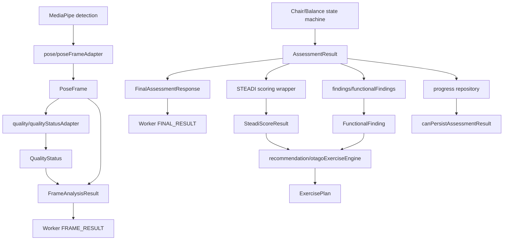

# Structured Pipeline Types

작성일: 2026-07-11

이 문서는 기존 안전 경계(`ResultSource`, `FRAME_RESULT`/`FINAL_RESULT`, 중앙 persistence 검증, stale session 차단)를 유지한 상태에서 추가한 새 분석 파이프라인 공통 타입과 runtime validation 위치를 정리한다.

## 관계도

## 타입 목록

- `PoseFrame`: MediaPipe landmark 결과를 내부 공통 구조로 변환한 frame 단위 입력이다. `sessionId`, numeric `frameId`, monotonic `timestampMs`, image size, normalized/world landmarks, confidence, person count, processing latency를 포함한다.
- `CalibrationProfile`: 검사별 calibration profile이다. `assessmentType`이 `CHAIR_STAND_30S` 또는 `FOUR_STAGE_BALANCE`로 고정되며, `VALID` 상태에서는 검사별 필수 reference를 요구한다.
- `QualityStatus`: 단일 quality gate의 공통 출력이다. 상태는 `READY`, `NOT_READY`, `PAUSED`, `BLOCKED`, `INVALID`만 허용하고 reason은 enum 객체로 제한한다.
- `AssessmentEvent`: 상태 전이와 판정 근거를 구조화한다. 주요 판정 이벤트는 `evidence`가 필요하다.
- `AssessmentResult`: 최종 검사 결과다. `ResultSource`, `sessionId`, `schemaVersion`, `analyzerVersion`, `qualitySummary`, `events`가 필수다.
- `ChairStandMeasurements`: 30초 Chair Stand primary measurement. `partialRepetitionRuleStatus`가 `NOT_IMPLEMENTED`이면 credit은 `0`이어야 한다.
- `BalanceMeasurements`: 4-Stage Balance primary measurement. stage별 `PASSED`, `FAILED`, `NOT_ATTEMPTED`, `INVALID`, `AMBIGUOUS`를 분리한다.
- `SecondaryObservation`: clinical score와 분리된 관찰값이다. `affectsClinicalScore`는 항상 `false`여야 한다.
- `FunctionalFinding`: 기능 관찰 기반 finding 타입이다. 특정 근육/질환명을 domain이나 finding으로 생성하지 않는다.
- `SteadiScoreResult`: CDC STEADI reference helper를 structured assessment에 적용한 scoring 출력이다. non-clinical 입력은 `NOT_SCORABLE`이다.
- `ExercisePlan`: deterministic Otago recommendation engine 출력 타입이다. source finding 없는 운동, HIGH risk professional review 누락, Demo/Fallback 기반 plan을 거부한다.
- `CareAgentAction`: Mobile Care Agent의 공용 action 계약이다. `shared/stage4CareAgentContract.cjs`가 Web projection을 strict 검증하며 자유 임상 판정 또는 처방 변경 필드를 거부한다.
- `FrameAnalysisResult`: Worker 중간 결과다. `isFinal: false`이며 저장 대상이 아니다.
- `FinalAssessmentResponse`: Worker 최종 결과다. `isFinal: true`이며 내부에 `AssessmentResult`를 담는다.

## 생성 주체와 소비 주체

| 타입 | 생성 주체 | 소비 주체 |
| --- | --- | --- |
| `PoseFrame` | `client/src/pipeline/pose/poseFrameAdapter.js` | quality adapter, Worker `FRAME_RESULT` |
| `QualityStatus` | `client/src/pipeline/quality/qualityStatusAdapter.js` | frame result, UI debug, future analyzers |
| `CalibrationProfile` | `client/src/pipeline/calibration/calibrationProfile.js` | future chair/balance analyzers |
| `AssessmentEvent` | `client/src/pipeline/assessment/events.js`, structured state machines | `AssessmentResult`, audit/debug |
| `AssessmentResult` | `client/src/pipeline/assessment/chairStand/chairStandStateMachine.js`, `client/src/pipeline/assessment/balanceTest/balanceTestStateMachine.js`, `client/src/pose/movementAnalyzers.js` | STEADI, findings, recommendation, progress |
| `SteadiScoreResult` | `client/src/hooks/useSteplyDashboard.js` structured scoring wrapper + `client/src/pose/steadiRules.js` CDC helper | recommendation, canonical Mobile session |
| `FunctionalFinding` | `findings/functionalFindings.js` | recommendation, canonical Mobile session |
| `ExercisePlan` | `recommendation/otagoExerciseEngine.js` | UI/progress/canonical Mobile session |
| `CareAgentAction` | Mobile `CarePlanner.kt` | Android tools, Room decision log, Web projection |

## Validation 위치

모든 주요 runtime validation은 `client/src/pipeline/shared/validation/runtimeValidation.js`에 있다.

- `validatePoseFrame`
- `validateCalibrationProfile`
- `validateCalibrationApplication`
- `validateQualityStatus`
- `validateAssessmentEvent`
- `validateAssessmentResult`
- `validateSteadiScoreResult`
- `validateFunctionalFinding`
- `validateExercisePlan`
- `validateWorkerCommand`
- `validateWorkerResponse`
- `validateFrameAnalysisResult`
- `validateFinalAssessmentResponse`

검증 실패는 throw가 아니라 `{ ok: false, failures: [...] }`로 반환된다. 사용자 화면에는 내부 validation failure를 직접 노출하지 않는다.

## Source And Persistence

새 타입은 기존 `ResultSource`를 그대로 사용한다.

- 저장 가능: `LIVE_POSE` + `VALID` + `FINAL_RESULT` + `analyzerFinalEvent` + valid timestamps + quality summary.
- 저장 금지: `DEMO`, `FALLBACK`, `MANUAL_TEST`, `INCOMPLETE`, `INVALID`, `CANCELLED`, `FRAME_RESULT`, stale session.
- `AssessmentResult.metadata.isPersistable`은 힌트일 뿐이며, `client/src/pipeline/progress/progressRepository.js`는 다시 기존 `canPersistAssessmentResult()`를 호출한다.
- `STRUCTURED_V2` runtime에서도 중앙 persistence 검증을 우회하지 않는다.

## Worker Boundary

`client/src/pose/poseLandmarker.worker.js`는 UI compatibility payload와 함께 다음 structured 필드를 보낸다.

- `FRAME_RESULT`: `poseFrame`, `qualityStatus`, `assessmentEvents`, `frameAnalysisResult`, `structuredValidation`
- `FINAL_RESULT`: `structuredAssessmentResult`, `finalResponse`, `structuredValidation`

`FrameAnalysisResult`는 `isFinal: false`라 저장할 수 없다. `FinalAssessmentResponse`는 `sessionId`와 `AssessmentResult.sessionId`가 일치해야 한다.

## Clinical Score Separation

Primary measurement만 STEADI scoring 입력으로 사용한다.

`SecondaryObservation.affectsClinicalScore`는 validation에서 `false`만 허용한다. trunk lean, asymmetry, sway pattern 같은 관찰값은 finding/recommendation 근거로만 사용할 수 있고 CDC score를 변경하지 못한다.
